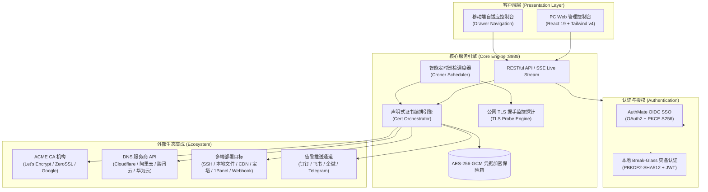

# SSL-Mate (证书伴侣)

<div align="center">
  
  <h2>SSL-Mate (证书伴侣)</h2>
  <p><strong>轻量级、现代化、企业级全自动 SSL/TLS 证书生命周期管理平台与 AuthMate OIDC SSO 单点登录引擎</strong></p>
  <p>告别繁琐易错的流程图连线，声明式 3 步向导配置全自动域名证书申请、全球 DNS 预检、多端部署与临期自动续期。</p>

  <p>
    <a href="https://github.com/tankeito/SSL-Mate/releases"></a>
    <a href="https://hub.docker.com/"></a>
    <a href="https://www.typescriptlang.org/"></a>
    <a href="https://react.dev/"></a>
    <a href="https://tailwindcss.com/"></a>
    <a href="https://datatracker.ietf.org/doc/html/rfc8555"></a>
    <a href="#-安全架构与凭据保护"></a>
    <a href="./LICENSE"></a>
  </p>
</div>

---

## 📖 目录

- [🌟 为什么选择 SSL-Mate](#-为什么选择-ssl-mate)
- [✨ 核心功能特性](#-核心功能特性)
- [📐 系统架构设计](#-系统架构设计)
- [🎯 极简 3 步任务模型](#-极简-3-步任务模型)
- [🔌 生态集成支持](#-生态集成支持)
- [🚀 快速开始](#-快速开始)
  - [方式一：Docker Compose 一键启动 (推荐)](#方式一docker-compose-一键启动-推荐)
  - [方式二：Docker CLI 容器运行](#方式二docker-cli-容器运行)
  - [方式三：源码本地运行与开发](#方式三源码本地运行与开发)
- [⚙️ 环境变量配置](#️-环境变量配置)
- [🔐 企业级 AuthMate OIDC SSO 单点登录对接](#-企业级-authmate-oidc-sso-单点登录对接)
- [🛡️ 安全架构与凭据保护](#️-安全架构与凭据保护)
- [❓ 常见问题 (FAQ)](#-常见问题-faq)
- [📄 开源协议](#-开源协议)

---

## 🌟 为什么选择 SSL-Mate

在传统 SSL 证书自动化运维方案中，很多工具采用复杂的图形化 DAG 流程图（连线节点编排）模式，对于简单直接的证书申请和分发任务而言，学习成本高、引脚容易连错、调试排错困难。

**SSL-Mate (证书伴侣)** 专为高效、可靠与安全而生，重塑为 **“声明式 3 步向导式任务模型”**：

- ⚡ **零门槛配置**：输入域名 $\rightarrow$ 选 CA 机构与 DNS 凭据 $\rightarrow$ 勾选部署目标（本地/SSH/云厂商/面板/Webhook）$\rightarrow$ 设定续期规则即可全自动托管。
- 🔒 **硬件级凭据安全**：所有云厂商 API Secret、SSH 私钥均基于系统 Master Key 派生采用 **AES-256-GCM** 加密后落盘，拒绝明文泄露。
- 🌐 **全网权威 DNS 广播预检**：DNS-01 验证挑战写入后，自动轮询全球权威 DNS 节点进行传播预检，从源头杜绝 Let's Encrypt 等 CA 校验超时失败。
- 🔄 **企业单点登录 & 灾备双轨**：原生集成 **AuthMate OIDC SSO (OAuth2 + PKCE S256)**，并配备本地 Break-Glass 灾备管理员通道，断网也能应急运维。
- 📡 **全链路 Live SSE 终端流**：证书申请、DNS 挑战、颁发归档、远程部署全流程实时输出终端日志流，排错一目了然。
- 📱 **极致现代体验**：React 19 + Tailwind CSS v4 + 深浅色主题自适应 + 全面适配手机移动端响应式布局。

---

## ✨ 核心功能特性

| 功能模块 | 特性说明 |
| :--- | :--- |
| **全自动证书生命周期** | 支持证书全自动申请、到期前 30 天（可自定义）自动巡检续期、证书链解析归档与吊销（Revoke）。 |
| **主流 CA 机构支持** | 原生兼容 Let's Encrypt (生产与 Staging)、ZeroSSL (EAB 凭据支持)、Google Trust Services (Google Public CA) 及自建 RFC 8555 兼容端点。 |
| **现代密钥算法** | 支持主流高强度椭圆曲线算法 `ECC P-256` (推荐)、`ECC P-384` 以及传统 `RSA 2048`、`RSA 4096`。 |
| **DNS-01 自动化验证** | 集成 Cloudflare、阿里云 DNS、腾讯云 DNSPod、华为云 DNS 等主流 DNS 解析服务商，支持泛域名 `*.example.com` 申请。 |
| **多目标分发与部署** | 一键自动部署至本地目录（配合重载脚本）、远程 SSH/SFTP 服务器、阿里云 CDN/DCDN、腾讯云 CDN、Cloudflare SSL、宝塔面板、1Panel、雷池 SafeLine WAF 及通用 Webhook。 |
| **全网域名监控探针** | 批量导入线上公网 HTTPS 域名，定时发起 TLS 握手探针，实时检测远程证书链有效性、颁发者与剩余有效天数。 |
| **多通道告警推送** | 支持钉钉机器人（加签）、飞书机器人（签名校验）、企业微信机器人、Telegram Bot、自定义 Webhook，任务成功/失败/临期即时触达。 |
| **用户与权限控制 (RBAC)** | 多角色权限体系（超级管理员、运维操作员、只读审计员），支持用户启停、密码重置与安全防护。 |
| **实时日志与审计** | 实时 SSE (Server-Sent Events) 日志流管道，完整记录每一步 ACME 交互、DNS 记录添加与远程部署执行详情。 |

---

## 📐 系统架构设计



---

## 🎯 极简 3 步任务模型

```
  ┌─────────────────────────┐     ┌─────────────────────────┐     ┌─────────────────────────┐
  │  步骤 1: 域名与 CA 配置  │ ──> │  步骤 2: 部署目标分发   │ ──> │  步骤 3: 续期策略与告警 │
  │                         │     │                         │     │                         │
  │ • 输入单域名 / 泛域名   │     │ • 本地目录 + 重载命令   │     │ • 自动续期阈值(≤30天)   │
  │ • 选择 CA 机构与算法    │     │ • 远程 SSH / SFTP 主机  │     │ • 每日巡检 Cron 表达式  │
  │ • 绑定 DNS 云凭据       │     │ • 云厂商 CDN / 面板     │     │ • 勾选即时告警推送通道  │
  └─────────────────────────┘     └─────────────────────────┘     └─────────────────────────┘
```

1. **步骤 1：域名与 CA 申请配置**
   - 输入泛域名或多域名（如 `example.com`、`*.example.com`）；
   - 选择 CA 机构（Let's Encrypt / ZeroSSL / Google Trust / 自定义 ACME）；
   - 选择绑定的 DNS 凭据（Cloudflare Token / 阿里云 AccessKey / 腾讯云 SecretId / 华为云 AccessKey）；
   - 选择加密算法（推荐 `ECC P-256`，体积小、性能高、握手快）。
2. **步骤 2：部署目标多选分发**
   - 📁 **本地文件**：指定目标路径（证书/私钥），并附带本地生效脚本（如 `systemctl reload nginx`）；
   - 🖥️ **远程 SSH/SFTP 主机**：自动上传证书至远程服务器指定目录，并通过 SSH 执行远程重载命令；
   - ☁️ **云厂商 CDN / SSL**：一键同步更新阿里云 CDN/DCDN、腾讯云 CDN、Cloudflare 自定义 SSL；
   - 🎛️ **运维面板与网关**：宝塔面板（BT-Panel）、1Panel、雷池 SafeLine WAF；
   - 🔗 **通用 Webhook**：通过 POST 方式推送证书与私钥 Payload 至业务自定义网关。
3. **步骤 3：续期策略与告警联动**
   - 设定到期前自动续期阈值（默认 $\le 30$ 天）；
   - 设定每日巡检 Cron 表达式（默认 `0 2 * * *` 每日凌晨 2 点）；
   - 勾选通知通道（钉钉 / 飞书 / 企微 / Telegram）。

---

## 🔌 生态集成支持

### 1. DNS 服务商 (DNS-01 验证)
| 提供商 | 支持类型 | 认证所需凭据 |
| :--- | :--- | :--- |
| **Cloudflare** | 权威 DNS | API Token / Global API Key |
| **阿里云 (Alibaba Cloud)** | 云解析 DNS | AccessKey ID + AccessKey Secret |
| **腾讯云 (Tencent Cloud)** | DNSPod 解析 | SecretId + SecretKey |
| **华为云 (Huawei Cloud)** | 云解析 DNS | AccessKey ID + Secret Access Key |

### 2. 部署目标 (Deployment Targets)
| 目标类型 | 适用场景 | 核心参数与能力 |
| :--- | :--- | :--- |
| **本地文件 (Local)** | 同机部署 Nginx / Apache / Caddy | 自定义文件输出路径、证书合并模式、本地 Shell 重载命令 |
| **远程 SSH / SFTP** | 远程 Linux 服务器集群 | 主机地址、SSH 端口、用户名、密码/私钥、目标目录、远程 Post 命令 |
| **阿里云 CDN** | 阿里云全站加速与 CDN 域名 | AccessKey 凭证、CDN 加速域名证书更新 |
| **腾讯云 CDN** | 腾讯云全站加速 / CDN 域名 | SecretId 凭证、CDN 加速域名一键更新 |
| **Cloudflare SSL** | Cloudflare Custom Certificate | API Token、Zone ID、自定义 SSL 证书上传与替换 |
| **宝塔面板 (BT-Panel)** | 宝塔 Linux 面板站点 | 面板地址、API Key、目标绑定站点名称、自动保存并重载 |
| **1Panel 面板** | 1Panel 现代化开源面板 | 1Panel API URL、API Key、目标网站证书一键同步 |
| **雷池 SafeLine WAF** | 长亭雷池 Web 应用防火墙 | WAF 控制台地址、API Token、关联防护站点 |
| **通用 Webhook** | 自定义网关 / 服务端回调 | Webhook URL、自定义 HTTP Header、JSON 证书 Payload 结构 |

### 3. 告警推送通道
| 通道名称 | 认证方式 | 特性说明 |
| :--- | :--- | :--- |
| **钉钉 (DingTalk)** | Webhook + 密钥加签 | 支持自定义加签 Secret，防止恶意伪造 |
| **飞书 (Feishu / Lark)** | Webhook + 签名校验 | 支持富文本消息卡片与签名密钥验证 |
| **企业微信 (WeCom)** | Webhook Key | 支持 Markdown 格式告警卡片消息 |
| **Telegram Bot** | Bot Token + Chat ID | 支持境外服务器与跨平台实时电报通知 |
| **自定义 Webhook** | POST JSON Payload | 自由对接各类企业告警中台或自动化流水线 |

---

## 🚀 快速开始

### 方式一：Docker Compose 一键启动 (推荐)

创建 `docker-compose.yml` 文件：

```yaml
version: '3.8'

services:
  ssl-mate:
    image: node:22-alpine
    container_name: ssl-mate
    restart: always
    ports:
      - "8989:8989"
    environment:
      - NODE_ENV=production
      - PORT=8989
      - DATA_DIR=/app/data
      - JWT_SECRET=your_custom_jwt_secret_key_change_me
      - MASTER_KEY=your_custom_master_encryption_key_32bytes_change_me
    volumes:
      - ./data:/app/data
```

启动容器：
```bash
docker compose up -d
```

打开浏览器访问：`http://your-server-ip:8989`

---

### 方式二：Docker CLI 容器运行

```bash
docker run -d \
  --name ssl-mate \
  --restart always \
  -p 8989:8989 \
  -e NODE_ENV=production \
  -e PORT=8989 \
  -e JWT_SECRET=your_custom_jwt_secret_key_change_me \
  -e MASTER_KEY=your_custom_master_encryption_key_32bytes_change_me \
  -v $(pwd)/data:/app/data \
  your-registry/ssl-mate:latest
```

---

### 方式三：源码本地运行与开发

**环境要求**：Node.js $\ge 20.0.0$

```bash
# 1. 克隆代码仓库
git clone https://github.com/tankeito/SSL-Mate.git
cd SSL-Mate

# 2. 安装依赖
npm install

# 3. 复制并调整环境变量文件
cp .env.example .env

# 4. 启动前端 Vite 本地开发服务器 (默认端口 5174)
npm run dev

# 5. (另开终端) 启动后端 API 服务 (默认端口 8989)
npm run dev:api
```

打开浏览器访问：`http://127.0.0.1:5174`

---

## ⚙️ 环境变量配置

可根据部署需要配置根目录下的 `.env` 文件：

```ini
# ==========================================
# SSL-Mate 基础服务配置
# ==========================================
PORT=8989
DATA_DIR=./data
NODE_ENV=production

# 核心安全密钥 (生产环境务必替换为高强度随机字符串)
JWT_SECRET=sslmate_super_secret_jwt_key_example_random_string
MASTER_KEY=sslmate_master_encryption_key_32bytes_example_sec

# ==========================================
# AuthMate OIDC SSO 单点登录对接 (可选)
# ==========================================
AUTHMATE_ENABLED=true
AUTHMATE_ISSUER_URL=https://auth.yourdomain.com
AUTHMATE_CLIENT_ID=sslmate-app
AUTHMATE_CLIENT_SECRET=your-authmate-client-secret
AUTHMATE_REDIRECT_URI=https://ssl.yourdomain.com/oauth/callback
```

| 变量名 | 默认值 | 作用说明 |
| :--- | :--- | :--- |
| `PORT` | `8989` | 后端服务监听端口 |
| `DATA_DIR` | `./data` | 数据持久化与证书文件存储目录 |
| `JWT_SECRET` | 随机默认 | JWT 用户登录鉴权 Token 签名密钥 |
| `MASTER_KEY` | 随机默认 | AES-256-GCM 凭据库硬件级加密主密钥 |
| `AUTHMATE_ENABLED` | `false` | 是否启用 AuthMate OIDC 单点登录 |
| `AUTHMATE_ISSUER_URL` | - | AuthMate OIDC 服务端根地址 (IdP) |
| `AUTHMATE_CLIENT_ID` | `sslmate-app` | OIDC 注册的客户端 ID |
| `AUTHMATE_CLIENT_SECRET`| - | OIDC 注册的客户端密钥 |
| `AUTHMATE_REDIRECT_URI` | - | OIDC 授权回调完整地址 |

---

## 🔐 企业级 AuthMate OIDC SSO 单点登录对接

SSL-Mate 原生内置对 **AuthMate** (及兼容 OIDC/OAuth2 标准的 IdP 提供商) 的全功能对接支持：

```
  ┌────────────────┐         1. 跳转授权         ┌────────────────┐
  │                │ ─────────────────────────> │                │
  │    SSL-Mate    │                            │    AuthMate    │
  │  (Web Client)  │ <───────────────────────── │   (OIDC IdP)   │
  │                │    2. 携带 Code & State    └────────────────┘
  └───────┬────────┘
          │ 3. 兑换 Token (PKCE S256)
          ▼
  ┌────────────────┐
  │ SSL-Mate Core  │ ──> 校验成功，签发会话，自动同步用户信息
  └────────────────┘
```

1. **客户端注册**：在 AuthMate 控制台注册客户端应用，重定向回调地址填写 `https://your-sslmate-domain/oauth/callback`；
2. **系统配置**：在 SSL-Mate 后台 **【系统与 SSO】** 菜单或 `.env` 填入 `Issuer URL`、`Client ID` 与 `Client Secret`；
3. **一键登录**：用户访问登录页点击 **【使用 AuthMate 账号一键登录】**，即可实现免密无缝安全访问；
4. **本地灾备账号 (Break-Glass)**：
   - 即使 SSO 服务端维护或断网，管理员依然可在登录页切换使用 **【本地灾备管理员登录】**；
   - 默认管理员账号密码可在初始化后于后台 **【用户管理】** 自由修改或重置。

---

## 🛡️ 安全架构与凭据保护

1. **数据库脱敏与强加密落盘**：
   - 所有云厂商 AccessKey/Secret、SSH 私钥与面板 Token 在写入磁盘数据库前，均通过系统 Master Key 派生采用 **AES-256-GCM** 高强度认证加密算法，绝不以明文存储；
   - 本地用户密码基于 **PBKDF2-SHA512** 进行 100,000 次哈希迭代加盐计算。
2. **私钥独立生成**：
   - CSR 与域名专属私钥（ECC/RSA）均在本地沙箱内独立生成，私钥从不离开用户受控环境。
3. **RBAC 权限防误操作**：
   - 系统内置安全拦截机制，禁止管理员删除或禁用自身账号，杜绝死锁风险。

---

## ❓ 常见问题 (FAQ)

<details>
<summary><strong>Q1: 为什么 DNS-01 验证有时会提示没有找到 TXT 记录？</strong></summary>

> **解答**：部分 DNS 厂商的全球节点同步可能存在数秒至数十秒的广播延迟。SSL-Mate 内置了**全球权威 DNS 广播预检机制**，会在向 CA 提交验证前自动轮询检测 TXT 记录是否已在权威节点生效。若遇到偶尔超时，可检查云厂商 API 凭证权限是否授予了 DNS 修改权限。
</details>

<details>
<summary><strong>Q2: 自动续期任务的触发时机是什么？</strong></summary>

> **解答**：系统调度器会在每天设定的巡检时间（如每日凌晨 2 点）自动遍历活跃任务。当发现证书距离到期剩余天数 $\le$ 任务设定的续期阈值（默认 30 天）时，自动触发全流程重新签发并执行多端部署，续期成功或失败将根据配置发送即时告警。
</details>

<details>
<summary><strong>Q3: 如果 AuthMate SSO 服务维护或外网中断，如何进入控制台？</strong></summary>

> **解答**：在登录界面点击 **【使用本地灾备管理员登录 (Break-Glass)】**，输入本地管理员账号和密码即可正常登录运维，确保极端情况下业务连续性不受影响。
</details>

---

## 📄 开源协议

本项目基于 [MIT License](./LICENSE) 开源。欢迎提交 Issue 与 Pull Request 共同完善！

<div align="center">
  <sub>Built with ❤️ for DevOps & Cloud Engineers by SSL-Mate Team</sub>
</div>
