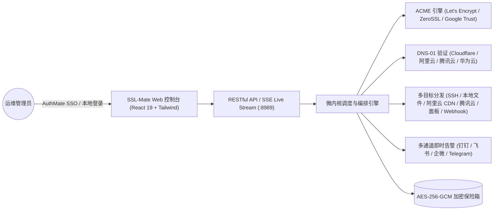

# SSL-Mate (证书伴侣)

<div align="center">
  
  <h3>轻量级、极简、企业级全自动 SSL 证书生命周期管理平台与 AuthMate OIDC SSO 单点登录引擎</h3>
  <p>告别繁琐复杂的流程图连线，3 步配置全自动域名证书申请、多端部署与到期前 30 天自动续期。</p>

  <p>
    
    
    
    
    
  </p>
</div>

---

## 目录

- [一、 为什么选择 SSL-Mate (对比传统工具)](#一-为什么选择-ssl-mate-对比传统工具)
- [二、 核心架构与特性](#二-核心架构与特性)
- [三、 极简 3 步任务模型](#三-极简-3-步任务模型)
- [四、 AuthMate OIDC SSO 单点登录对接](#四-authmate-oidc-sso-单点登录对接)
- [五、 本地快速启动](#五-本地快速启动)
- [六、 生产环境 Docker 部署](#六-生产环境-docker-部署)
- [七、 常见问题与灾备说明](#七-常见问题与灾备说明)

---

## 一、 为什么选择 SSL-Mate (对比传统工具)

在日常运维管理中，AllinSSL 等工具采用了图形化流程图（DAG 节点编排）方式，设置极其繁琐，输入输出引脚容易连错，排错断点成本极高。

**SSL-Mate (证书伴侣)** 彻底去除了流程图概念，重塑为 **“声明式 3 步向导式任务”**：
1. **零门槛配置**：输入域名 -> 选 CA 机构和 DNS 凭据 -> 勾选部署目标（本地/SSH/云厂商/宝塔/Webhook）-> 设定续期天数即可。
2. **硬件级安全凭据库**：所有云厂商 API Secret、SSH 私钥均通过 **AES-256-GCM** 加密后落盘。
3. **原生无缝集成 AuthMate OIDC SSO**：单点登录、免密通行，且自带本地灾备登录双轨机制。
4. **实时 Live SSE 日志终端**：申请与部署全链路输出实时终端流，排错一目了然。

---

## 二、 核心架构与特性



---

## 三、 极简 3 步任务模型

- **步骤 1：域名与 CA 申请配置**
  - 输入泛域名或多域名（如 `example.com`、`*.example.com`）。
  - 选择 CA 机构（Let's Encrypt / ZeroSSL / Google Public CA / 自定义 ACME）。
  - 选择已绑定的 DNS 云厂商 API 凭据（Cloudflare Token / 阿里云 AccessKey / 腾讯云 SecretId）。
  - 选择加密算法（ECC P-256 推荐 / ECC P-384 / RSA 2048 / RSA 4096）。
- **步骤 2：部署目标多选分发**
  - 📁 **本地文件**：写入目录并自动执行本地重载命令（如 `systemctl reload nginx`）。
  - 🖥️ **远程 SSH/SFTP 主机**：自动上传证书至远程服务器并执行远程重载。
  - ☁️ **云厂商 CDN/SSL 托管**：一键更新阿里云 CDN、腾讯云 CDN / SSL、Cloudflare Custom SSL。
  - 🎛️ **面板网关**：宝塔面板、1Panel、雷池 SafeLine WAF。
  - 🔗 **通用 Webhook**：推送证书 JSON Payload 至外部网关。
- **步骤 3：续期策略与通知**
  - 自动续期阈值（到期前 $\le 30$ 天自动触发）。
  - 每日巡检 Cron 表达式。
  - 勾选通知通道（钉钉 / 飞书 / 企微 / Telegram）。

---

## 四、 AuthMate OIDC SSO 单点登录对接

SSL-Mate 原生支持与 `E:\ai\AuthMate` 深度互信：

1. 打开 **【系统与 SSO】** 菜单；
2. 填写 AuthMate IdP 服务器地址（如 `http://127.0.0.1:8787` 或 `https://auth.yourdomain.com`）；
3. 填写 `Client ID` 和 `Client Secret`；
4. 用户在登录页面点击 **【使用 AuthMate 账号一键登录】** 即可免密登录！
5. **本地灾备账号（Break-Glass）**：默认账号 `admin`，初始密码 `admin123`（支持在后台随时修改）。

---

## 五、 本地快速启动

```bash
# 1. 安装依赖
npm install

# 2. 启动前端 Vite 本地开发服务器 (默认端口 5174)
npm run dev

# 3. (另开终端) 启动后端 API 服务 (默认端口 8989)
npm run dev:api
```

打开浏览器访问：[**http://127.0.0.1:5174**](http://127.0.0.1:5174)。

---

## 六、 生产环境 Docker 部署

使用 `docker-compose.yml` 一键拉起：

```bash
docker compose up -d
```

---

## 七、 常见问题与灾备说明

- **如果 AuthMate SSO 服务暂时维护或断网，如何登录？**  
  在登录界面点击【使用本地灾备管理员登录 (Break-Glass)】，输入本地管理员账号（默认 `admin` / `admin123`）即可登录。
- **证书私钥安全性如何保障？**  
  所有私钥及 API Secret 在存储至本地数据库前，均通过系统 Master Key 派生的 **AES-256-GCM** 算法加密，绝不存储明文。
